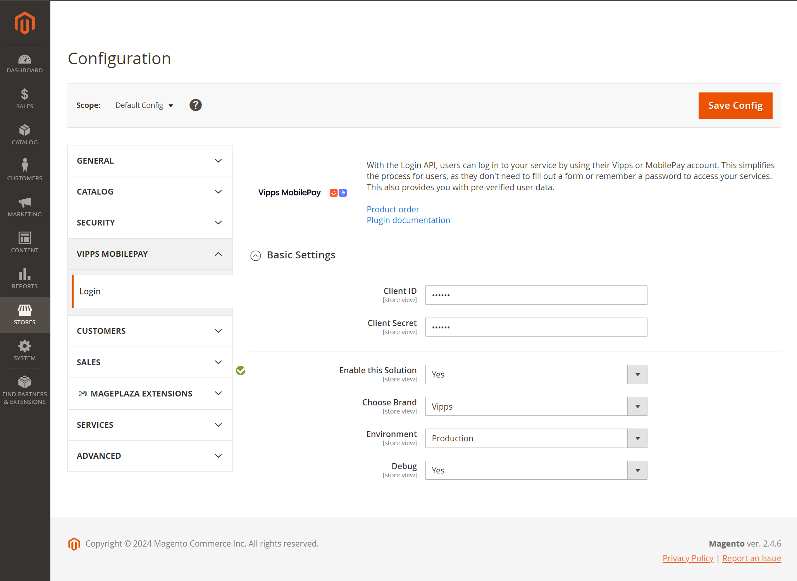

<!-- START_METADATA
---
title: Vipps/MobilePay Login for Adobe Commerce / Magento Plugin installation guide
sidebar_label: Installation guide
sidebar_position: 20
description: Install the Vipps/MobilePay Login for Adobe Commerce.
pagination_next: null
pagination_prev: null
---
END_METADATA -->

# Login module installation guide

This is the guide for installing *Vipps/MobilePay Login for Adobe Commerce* (the *Login module*).

## Prerequisites

1. [Adobe Commerce 2.4.0](https://experienceleague.adobe.com/en/docs/commerce-operations/release/notes/overview) or later.
    * [Adobe Commerce System Requirements](https://developer.adobe.com/commerce/docs/)
1. SSL must be installed on your site and active on your Checkout pages.
1. You must have a Vipps MobilePay merchant account and be configured for use of Login.
    * See [Vipps MobilePay configuration](#vipps-mobilepay-login-configuration-details)
1. As with *all* Adobe Commerce extensions, it is highly recommended backing up your site before installation and to install and test on a staging environment prior to production deployments.

## Installation via Composer

1. Navigate to your [Adobe Commerce root directory](https://developer.adobe.com/commerce/php/development/build/component-file-structure/).
1. Enter command: `composer require vipps/module-login`
1. Enter command: `php bin/magento module:enable Vipps_Login`
1. Enter command: `php bin/magento setup:upgrade`
1. Put your Adobe Commerce in production mode, if required.

## Configuration

The *Vipps/MobilePay Login* module can be easily configured to meet business expectations of your web store. This section will show you how to configure the extension via Adobe Commerce.

From Adobe Commerce, navigate to *Stores* > *Configuration* > *Vipps MobilePay* > *Login*.

Configuration details are described below:

* [Adobe Commerce configuration](#adobe-commerce-configuration-details)
* [Vipps MobilePay configuration](#vipps-mobilepay-login-configuration-details)

Once you have finished with the configuration, click *Save* button.

### Adobe Commerce configuration details

Configure your Adobe Commerce account to work with Vipps MobilePay Login.

After installing the Login module, a new menu item should appear in your
store's *Configuration Navigation* under *Stores* > *Configuration* > *Vipps MobilePay* > *Login*.

Enter your `client_id` and `client_secret` (see
[How to find the API keys](https://developer.vippsmobilepay.com/docs/knowledge-base/portal/#how-to-find-the-api-keys)).

You can also switch between *Development* and *Production* mode. Note, to use the app in test mode, you must use the
[Vipps MobilePay test app](https://developer.vippsmobilepay.com/docs/knowledge-base/test-environment/#test-apps).

While debugging, you can enable *Debugging*. Note that this will log additional
data to your Adobe Commerce logs, so it is recommended that this is switched off.

After setting up the module, it should appear in the frontend in a few locations
automatically. For example, on the customer login page:

The customer registration page allows your customers to quickly register a
new account using their existing data in Vipps or MobilePay.

And, on the checkout page again allowing your customers to quickly log in not using
a traditional username and password, and fill in their information with the data that is already
stored in Vipps MobilePay.

Or log in with an authentication popup, where the Login button is also present.

Using the Login module, you can create a widget with *Sign In* button and put it in any
website location.

The frontend view may look like this:

When you have been registered, you will receive a confirmation email with
an updated template. Inside this email, you can set a password to your account or always
use Vipps MobilePay Login functionality.

### Vipps MobilePay Login configuration details

1. Create your merchant account with Vipps MobilePay

    To start using Login, you must first have a Vipps MobilePay merchant account with login
    functionality. If you don't already have this, you can
    [*Login*](https://vippsmobilepay.com/online/login).

2. Retrieve your [API keys](https://developer.vippsmobilepay.com/docs/knowledge-base/api-keys/) to send with your API requests.

3. [Activate Vipps MobilePay Login](https://developer.vippsmobilepay.com/docs/knowledge-base/portal/#how-to-set-up-login-for-your-sales-unit) for your sales unit.

To use the app in test mode, you must use the
[Vipps MobilePay test app](https://developer.vippsmobilepay.com/docs/knowledge-base/test-environment/#test-apps).
:::
