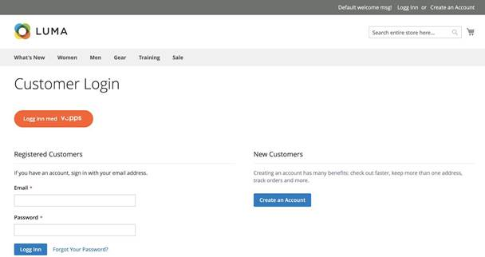
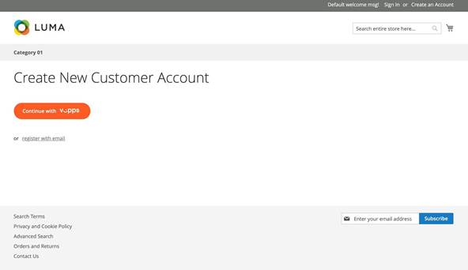
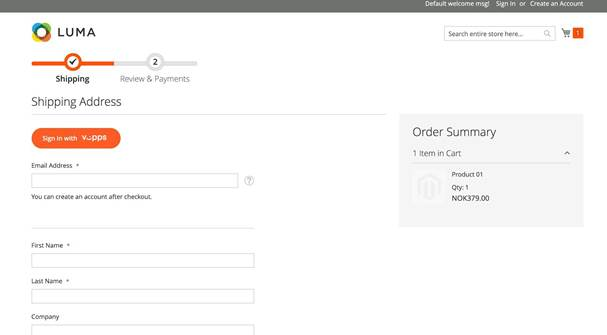
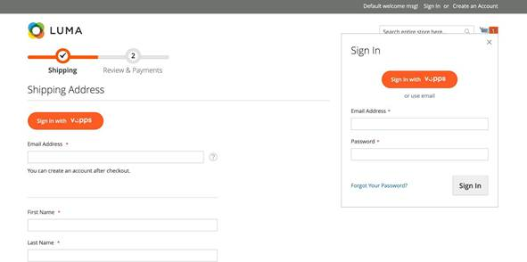
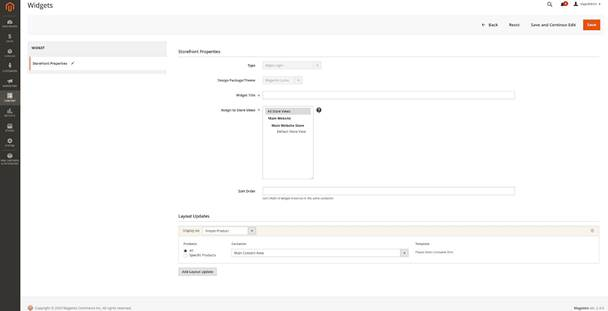
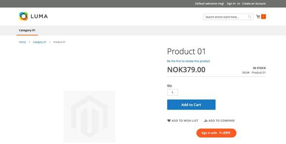
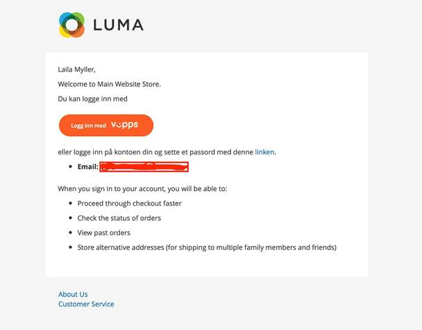

<!-- START_METADATA
---
title: Login for Magento Plugin installation guide
sidebar_label: Installation guide
sidebar_position: 20
description: Install the Vipps/MobilePay Login for Adobe Commerce.
pagination_next: null
pagination_prev: null
---
END_METADATA -->

# Installation guide

Install the *Vipps/MobilePay Login for Adobe Commerce* plugin.

## Prerequisites

1. [Magento 2.2](https://devdocs.magento.com/guides/v2.2/release-notes/bk-release-notes.html) or later.
    * [Magento 2 System Requirements](http://devdocs.magento.com/magento-system-requirements.html)
1. SSL must be installed on your site and active on your Checkout pages.
1. You must have a Vipps merchant account.
    * See [*Login*](https://vippsmobilepay.com/online/login).
1. As with *all* Magento extensions, it is highly recommended backing up your site before installation and to install and test on a staging environment prior to production deployments.

## Installation via Composer

1. Navigate to your [Magento root directory](https://devdocs.magento.com/guides/v2.2/extension-dev-guide/build/module-file-structure.html).
1. Enter command: `composer require vipps/module-login`
1. Enter command: `php bin/magento module:enable Vipps_Login`
1. Enter command: `php bin/magento setup:upgrade`
1. Put your Magento in production mode if it's required.

## Configuration

The Vipps MobilePay Login module can be easily configured to meet business expectations of your web store. This section will show you how to configure the extension via *Magento Admin*.

From *Magento Admin*, navigate to *Store* > *Configuration* > *Vipps* > *Login*.

Configuration details are described below:

* [Magento configuration](#magento-configuration-details)
* [Vipps MobilePay configuration](#vipps-mobilepay-login-configuration-details)

Once you have finished with the configuration, click *Save* button.

### Magento configuration details

Configure your Magento account to work with Vipps MobilePay Login.

After installing the Login module, a new menu item should appear in your
store's *Configuration Navigation*.
From here, you can enter your `client_id` and `client_secret` that was referred to
in the previous section.

You can also switch between *Development* and *Production* mode.

While debugging, you can enable *Debugging*. Note that this will log additional
data to your Magento logs, so it is recommended that this is switched off.

After setting up the module, it should appear in the frontend in a few locations
automatically. For example, on the customer login page:

The customer registration page allows your customers to quickly register a
new account using their existing data in Vipps or MobilePay.

And, on the checkout page again allowing your customers to quickly log in not using
a traditional username and password, and fill in their information with the data that is already
stored in Vipps.

Or log in with an authentication popup, where the Login button is also present.

Using the Login module, you can create a widget with *Sign In* button and put it in any
website location.

The frontend view may look like this:.

When you have been registered, you will receive a confirmation email with
an updated template. Inside this email, you can set a password to your account or always
use Vipps MobilePay Login functionality.

### Vipps MobilePay Login configuration details

This section explains:

* How to find required credentials
* How to set up Vipps MobilePay Login for your sales unit
* What Redirect URIs to add to the Vipps MobilePay [Merchant Portal](https://portal.vippsmobilepay.com)

1. Create your merchant account with Vipps

    To start using Login, you must first have a Vipps MobilePay merchant account with login
    functionality. If you don't already have this, you can
    [*Login*](https://vippsmobilepay.com/online/login).

2. Retrieve your API Keys to send with your API requests

    Once you have an account, log in to the merchant portal at [portal.vippsmobilepay.com](https://portal.vippsmobilepay.com) and get your API keys​.

    You will find them by going to the *Developer* section, you will find the *API Keys* tab.
    There you can find a list of your sales units. Find the sales unit applicable to your store and press
    *Show Keys*. This will open a new panel with your `client_id` and `client_secret`.

    **Please note:** If you are already using your `client_secret` in another application, you should use the same in both applications.
    Either reuse the secret or generate a new secret and update it in both places.

    For more details, see:

    * [How to find a sales unit](https://developer.vippsmobilepay.com/docs/developer-resources/portal/)
    * [API keys](https://developer.vippsmobilepay.com/docs/knowledge-base/api-keys/)

3. Activate Vipps MobilePay Login for your sales unit

    If you haven't already done so, activate *Vipps MobilePay Login* for your sales unit.
    Find your sales unit as you did in the last step.
    Once there, click the *Set up login* button.

    When asked to set up the redirect URIs, enter your Magento store's base URL +
    `/vipps/login/redirect`. For example,if your store is located at `​http://www.example.org/`,​ the URL would be: `http://www.example.org/vipps/login/redirect`.

    Note that if you are using store codes in the URL, this must also be included. For example, if the store code is `no`: `http://www.example.org/no/vipps/login/redirect`.

    For more details, see:

    * [How to find a sales unit](https://developer.vippsmobilepay.com/docs/developer-resources/portal/)
    * [How to set up Login for your sales unit](https://developer.vippsmobilepay.com/docs/developer-resources/portal/#how-to-set-up-login-for-your-sales-unit)

**Please note:** To use the app in test mode, you must use the Vipps test app. For instructions on how to set up the vipps test app, please see
[Vipps Knowledge base: Test apps](https://developer.vippsmobilepay.com/docs/test-environment/#test-apps).
