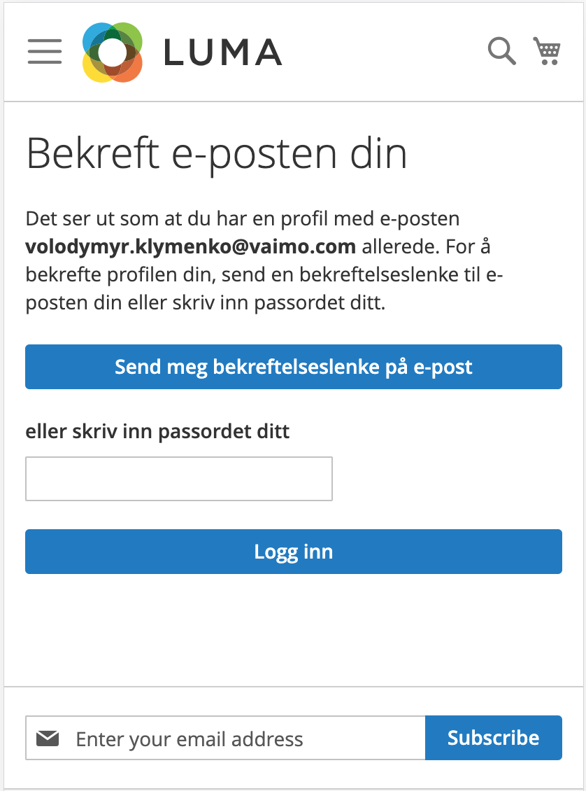

<!-- START_METADATA
---
title: Vipps/MobilePay Login for Adobe Commerce user guide
sidebar_label: User guide
sidebar_position: 30
hide_table_of_contents: true
pagination_next: null
pagination_prev: null
---
END_METADATA -->

# Login module user guide

This is the user guide for *Vipps/MobilePay Login for Adobe Commerce* (the *Login module*).

## Introduction

The Login module offers functionality for authenticating end users and authorizing clients.
It is founded on the OAuth2 and OpenID Connect specifications
and supports using web browsers on websites and in native apps for iOS and Android using app switching.

## Basic Flow

### Sign-in or register using Vipps or MobilePay

The sequence of operations is as follows:

1. The customer presses a button to sign-in or register with Vipps or MobilePay and is redirected to a Vipps MobilePay web page.
1. The customer interacts with the Vipps MobilePay web page and mobile app to permit access to account data for the webshop.
1. The customer is redirected back to Adobe Commerce webshop.
1. If access was granted to the webshop, the plugin has access to customer data such as: name, email, phone number, and addresses.
1. Adobe Commerce performs the log-in or creates a new account for the customer.

    If the customer has granted consent for Adobe Commerce to use their phone number, Adobe Commerce can then use the Vipps/MobilePay Login module to check if the account exists.
    Adobe Commerce checks if the system already contains an account that is linked with the Vipps or MobilePay account. If yes, the customer is already verified and the log-in can be completed.
    If no, it can mean one of the following:

    * The customer's account has not been previously linked with Vipps or MobilePay. They will need to confirm or link accounts.
    * The customer does not have an account and must create one.

### Confirm existing account

In the case when a customer doesn't have an Adobe Commerce account which has been previously linked with Vipps MobilePay,
Adobe Commerce will try to find existing Adobe Commerce account by using the email and phone number obtained from Vipps MobilePay.
If the account exists, it will redirect customer to *Confirmation* page.

The customer can finish the process by using password or email confirmation.
When the account is confirmed, it will be linked with Vipps MobilePay account. Thus, no extra steps are needed for a later sign-in.

<!---->

### Create a new account

If there is no account defined for customer then Adobe Commerce will try automatically create a new account using Vipps MobilePay account data.

In the case when Adobe Commerce can't create an account automatically, the customer will be redirected to a standard Adobe Commerce registration form to complete it manually.
This could happen, for example if Adobe Commerce required additional data for account creation that is missing in Vipps MobilePay account.

### Link Adobe Commerce and Vipps MobilePay accounts

It is possible to link the customer account and Vipps MobilePay account that is being signed-in into the system.
To do this, customer should:

* Go to *My Account* page
* Choose *Login with Vipps* on the left menu
* Press *Login with Vipps* and finalize the process

<!---->

### Sync addresses between Vipps MobilePay and Adobe Commerce

Each time a customer signs in to the system, the Vipps MobilePay Login module checks if the customer's addresses have changed.

There are three ways to update the addresses and the customer is able to select from these:

* Update automatically - The customer will not be asked, but addresses will be automatically updated.
* Ask first - The customer will be asked before the update.
* Do nothing - The customer will not be asked, and addresses will not be updated.

<!---->

In the case when a behavior set to *ask first* and the Vipps MobilePay address(es) where changed, the customer will see a notification.

## Work with addresses

### Get addresses from Vipps MobilePay account

After logging in with Vipps MobilePay, all your Vipps MobilePay addresses will be transferred to the Adobe Commerce webshop and displayed in *My account* / *Address book* left menu item.

The addresses are stored into a separate `vipps_customer_address` table.

The addresses are automatically converted to the Adobe Commerce default billing and shipping address, if such do not exist.

### Default billing and shipping address

The Vipps MobilePay address that was converted to Adobe Commerce address is marked as *Applied/Used*.

<!---->

### Use Vipps MobilePay Address

If the Vipps MobilePay address was not converted to Adobe Commerce, there will be a link *Use Address*.

<!---->

By selecting *Use address*, the customer will be able to edit the address and save it in a standard Adobe Commerce way.

<!---->

### Adding new Adobe Commerce address

If customer is adding an address in a standard Adobe Commerce way and there is at least one Vipps MobilePay address that was not converted to Adobe Commerce (was not applied | not using), then the customer will be able to use their Vipps MobilePay address data for new address by choosing it in a dropdown menu at the top.

<!---->

NB! If customer changed any data so that newly created address and Vipps MobilePay address are different such addresses will not be linked between each other.

## Cart page

The Vipps MobilePay module injects a Vipps or MobilePay Login button on the cart page. This allows the customer to log in to the system and proceed to checkout.
This provides a better user experience, since they don't need to specify their shipping or billing address manually.

**Please note:** If the cart page contains an *Express Checkout* button from the *Vipps/MobilePay Payment module for Adobe Commerce*, only the *Login* button will be shown. *Login* has higher priority.

## Checkout page

### Sign-in

It is also possible to sign-in using Vipps or MobilePay from a checkout page.

<!---->

### Adding new address

If the customer wants to add an address directly from the checkout page, you can populate the form based on the unused Vipps MobilePay addresses.
This is done in the same manner as for *My account* / *Address book* page.

<!---->
