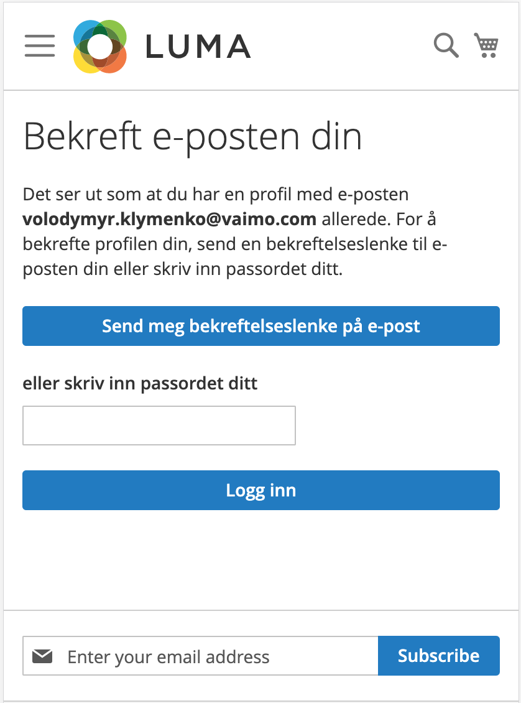
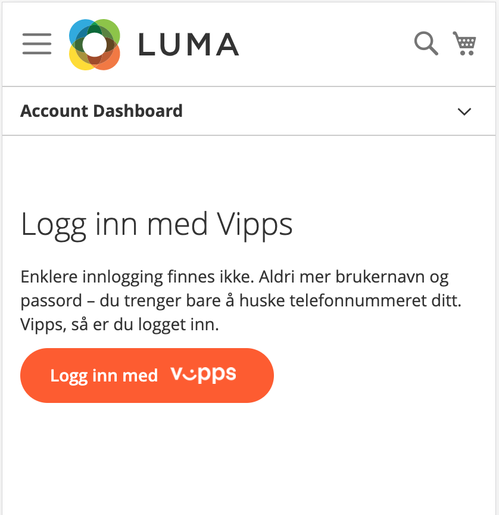
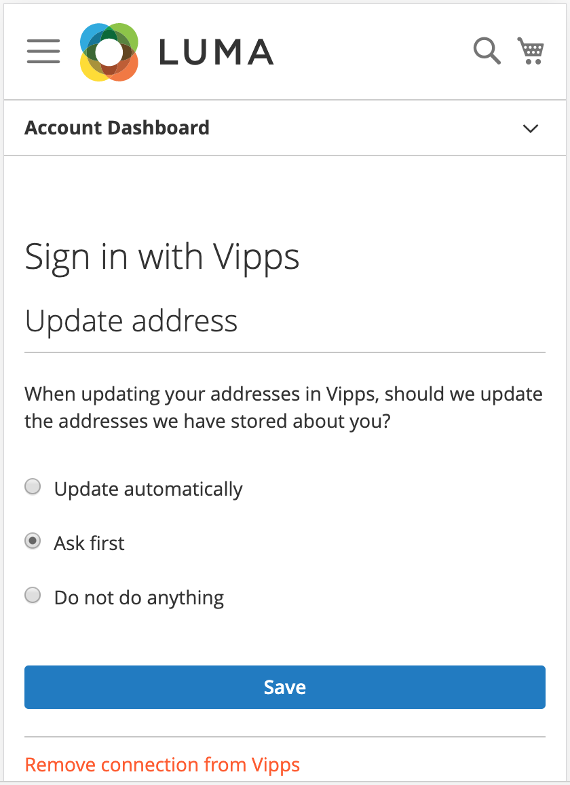
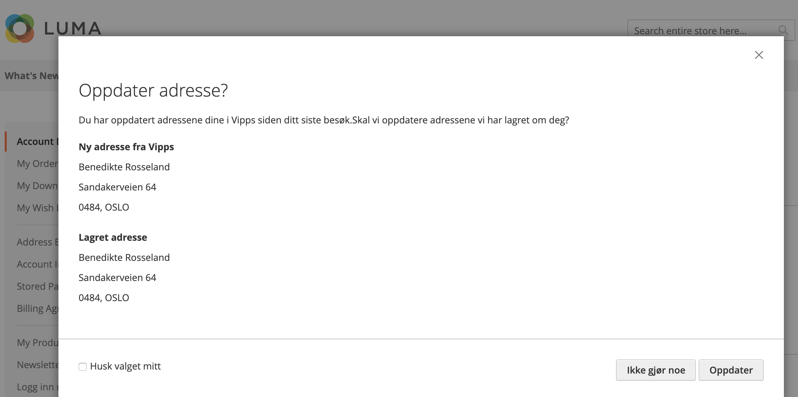
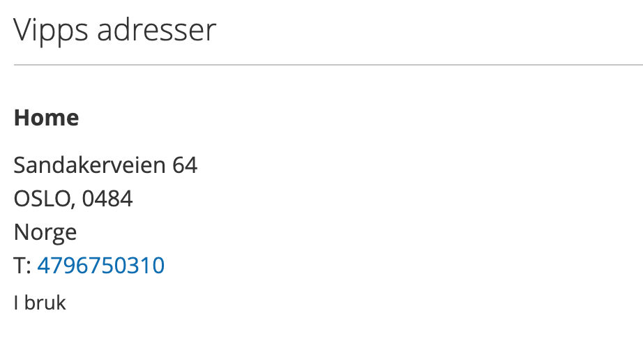
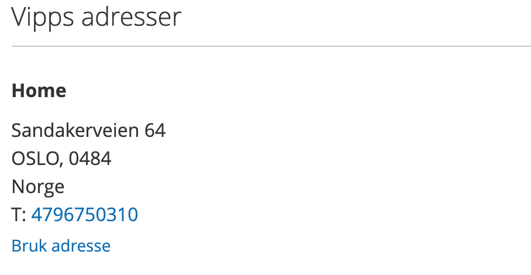
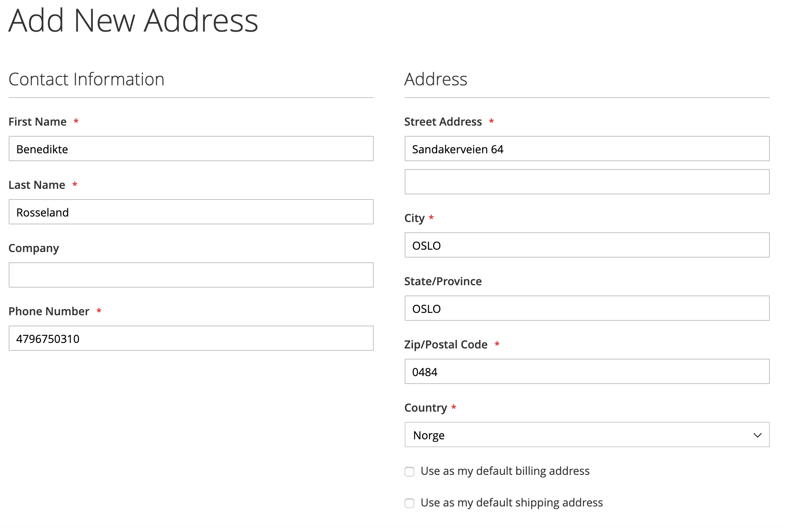
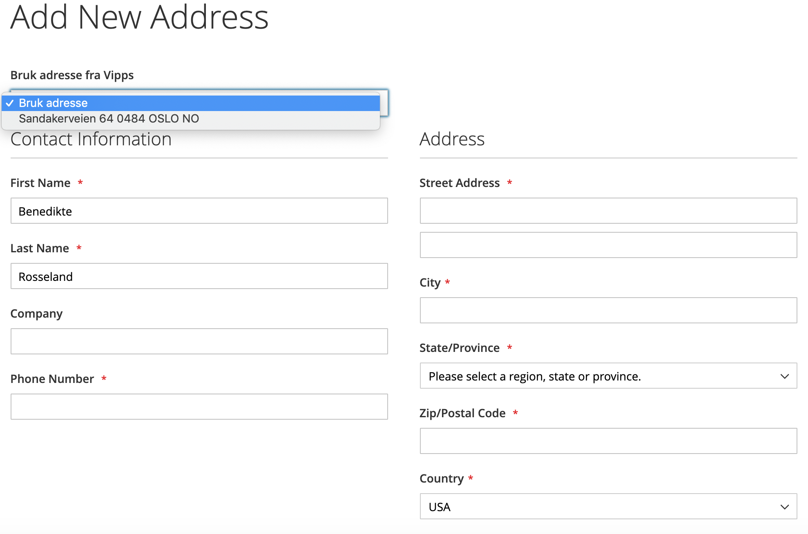
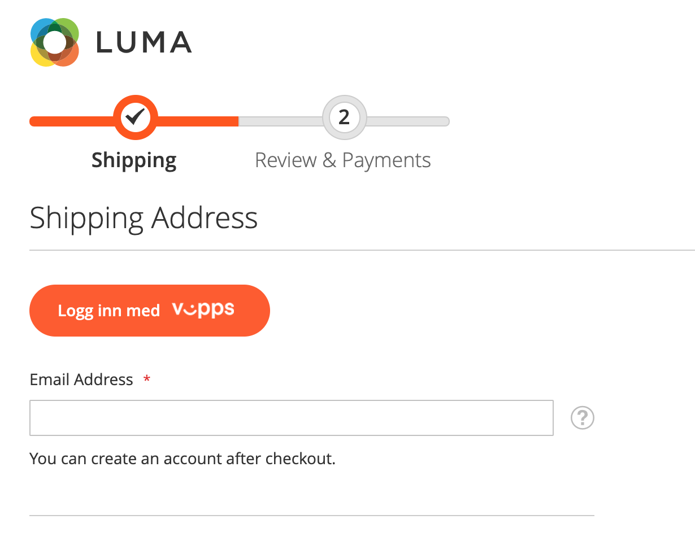
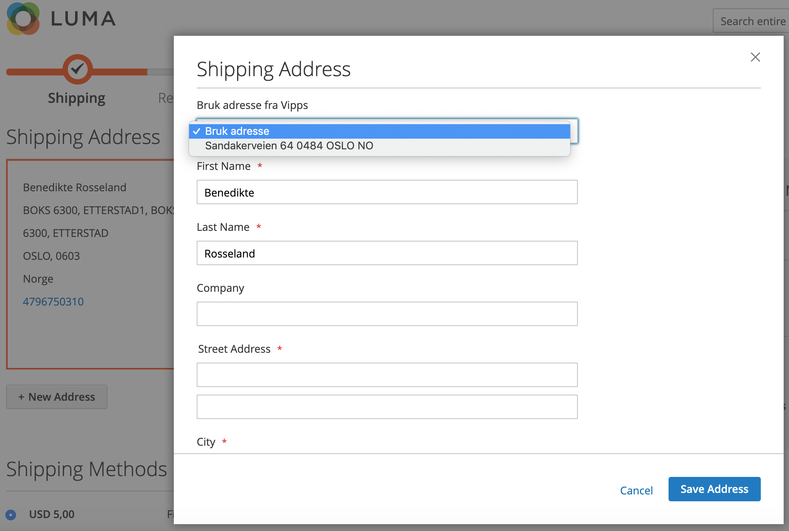

## Introduction

The Vipps Login module offers functionality for authenticating end users and authorizing clients founded on the OAuth2 and OpenID Connect specifications. It supports using web browsers on websites and in native apps for iOS and Android using app switching.

## Basic Flow

### Sign-In using Vipps / Register using Vipps

The sequence of operations is as follows:

 - Customer presses a "Sign-In with Vipps" / "Register with Vipps" button
 - Being redirected to Vipps web page customer interacts with Vipps web page and mobile app to permit access to Vipps account data for the webshop
 - Customer redirects back to Magento webshop
 - If access was granted the webshop (Vipps Login plugin) has access to customer Vipps account data such as: name, email, phone number, addresses, etc...
 - Magento does sign-in / creates a new account for customer.
 
To have a deeper understanding of the process let's consider last item at length.

Firstly, having access to customer's Vipps account data, Magento (the logic accumulated into Vipps Login module), using customer's phone number, checks - is there already existing account presents in the system that is linked with Vipps account? 

In case when check is positive then it means that customer already verified so does sign-in.

In case when check is negative it means that existing customer's account was not linked with Vipps before (customer has to confirm / link accounts) or customer does not have an account (customer has to create an account).

### Confirm existing account

In case when customer does not have a Magento account which has been linked with Vipps before, Magento will try to find existing Magento account using email and phone number obtained from Vipps and if it exists - redirect customer to "Confirmation" page

Customer could finish a process using password or email confirmation. When account confirmed it will be linked with Vipps account, so no extra steps need during next sign-in.

    
### Create a new account
  
If there is no account defined for customer then Magento will try automatically create a new account using Vipps account data.
   
In case when Magento can't create account automatically, customer will be redirected to standard Magento registration form to complete it manually.
It could happened if Magento requires some extra data for account creation that are missing in Vipps account.

### Link Magento and Vipps accounts

It is also possible to link customer account and Vipps account, being signed-in into the system.
To do this customer should do the following:
 - Go to "My Account" page
 - Choose "Login with Vipps" on the left menu
 - Press button "Login with Vipps" and finalize the process 
 

    
### Sync addresses between Vipps and Magento

Each time when customer signed-in into the system, Vipps Login module checks whether Vipps customer addresses were changed or not

There are three types of behavior in the module related to addresses update

 - update automatically; customer will not be asked, addresses will be automatically updated.
 - ask first; customer will be asked before update.
 - do nothing; customer will not be asked, addresses will not be updated.
 

So, customer could choose type of behavior.

In case when a behavior set to "ask first" and Vipps adress(es) where changed, customer will see a popup

## Work with addresses

### Get addresses from Vipps account

After Login In with Vipps all your Vipps addresses will be transferred to Magento webshop and displayed in "My account" / "Address book" left menu item.

Vipps addresses stores into a separate `vipps_customer_address` table.

Vipps addresses automatically converted to Magento default billing and shipping address if such does not exist.

### Default billing and shipping address

Vipps address that was converted to Magento address marked as "Applied/Used"

### Use Vipps Address

If Vipps address was not converted to Magento, such address has a link "Use Address"

By clicking on a link "Bruk addresse" customer will able to edit the address and save it in a standard Magento way.

### Adding new Magento address

If customer is adding address in a standard Magento way and there is at least one Vipps address that was not converted to Magento (was not applied | not using) then customer will able to use Vipps address data for new address by choosing it in a dropdown menu at the top.

NB! If customer changed any data so that newly created address and Vipps address are different such addresses will not be linked between each other.

## Cart page

Vipps module injects Vipps Login button on cart page that allows customer login into the system and proceed to checkout having better user experience since it does not need to specify shipping or billing address manually.

NB! In case when cart page contains Vipps Express Checkout button from Vipps Payment module - only Vipps Login button will be shown. Vipps Login has higher priority. 

## Checkout page

### Sign-in

It is also possible to sign-in using Vipps being on a checkout page. 

### Adding new address

If customer wants to add address directly on a checkout page it is also possible to populate form based on unused Vipps address in the same manner as it works for "My account" / "Address book" page.

